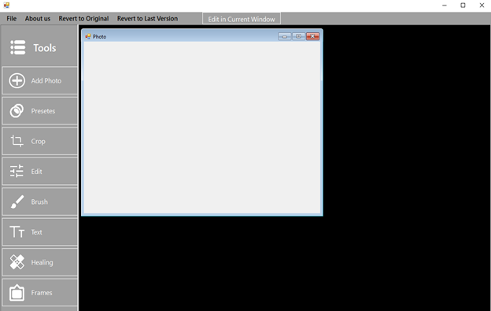

# Photo-editing-application
The developed application is an image editor built using C# in Visual Studio, based on a modular and layered architecture. The implementation is done using Windows Forms with an MDI (Multiple Document Interface) model, allowing multiple images to be managed simultaneously within a single main window.  

## **Main Features**  
- **Image Editing and Adjustment:** Apply predefined filters such as Clarendon and Kodachrome, adjust RGB parameters, contrast, and brightness.  
- **Drawing Tools:** Brushes, geometric shapes, color fill, color palette, and eraser.  
- **Text Addition:** Customize text with different fonts, sizes, colors, and styles.  
- **Restoration and Retouching:** Functions for blemish removal, area cloning, and restoring degraded images.  

The graphical user interface is intuitive, featuring a modern design adaptable to different screen resolutions. The application’s performance is optimized to run efficiently on various hardware configurations and to handle large images without lag.  

## **Interface Screenshot**  

